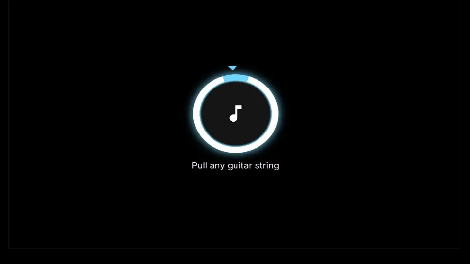
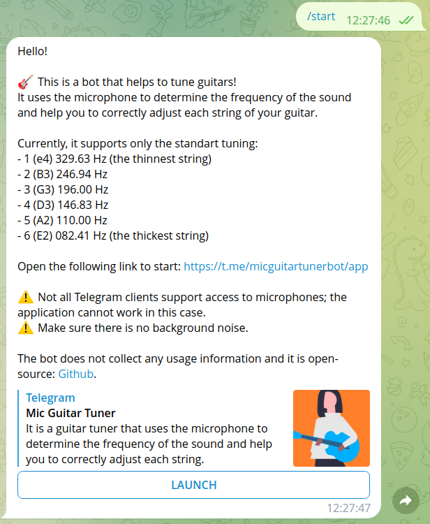

# Telegram Mic Guitar Tuner

This is a Telegram mini-app that helps guitarists tune their guitars. It uses
the microphone to determine the frequency of the sound and help you
to correctly adjust each string.



## Features

- Adjusting the frequency using the microphone.
- Standart guitar tuning.
- Telegram theme integration.

## Known issues

- Some Telegram clients may not support microphone access.

## Getting Started

### Running frontend locally

```shell
# Install dependencies:
yarn install

# Start the development server:
yarn dev
```

Open [http://localhost:3000](http://localhost:3000) with your browser to see the result.

### Connecting to telegram

Run [ngrok](https://ngrok.com/docs/) in order to expose the local application to the Internet:

```shell
ngrok http 3000
```

Create a new app using [@BotFather](https://t.me/BotFather), specify the **https** link of your ngrok. You can use [this one](./src/assets/miniappcover.png) as a photo.

Try to open the link in Telegram.

### Running telegram bot locally \[optional\]

The telegram bot responds with a welcome message to any message.

Prepare the config:

```shell
cp .env.example .env
```

Create a new bot using [@BotFather](https://t.me/BotFather) if you haven't done it yet and set the correct token in [.env](.env).

Start the bot:

```shell
yarn run bot
```

Write any message to the bot:


### Start everything in docker-compose

Specify the correct `TELEGRAM_TOKEN` in [.env](.env).

Start docker compose containers:

```shell
docker compose up --build
```

Expose the frontend using ngrok: [see](#connecting-to-telegram).

## License

[See](LICENSE).
